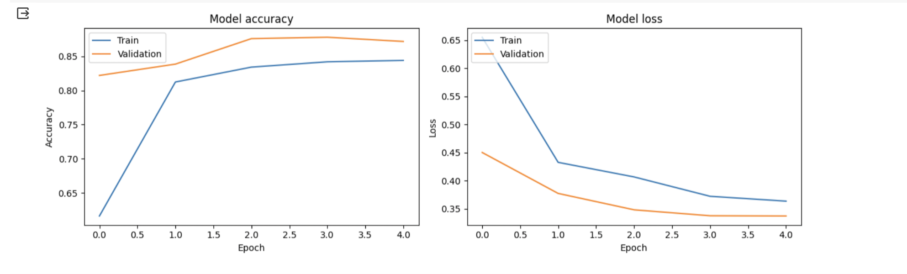
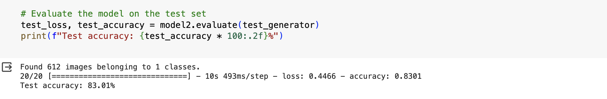
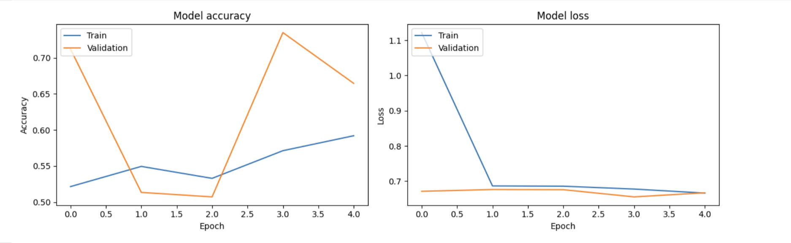
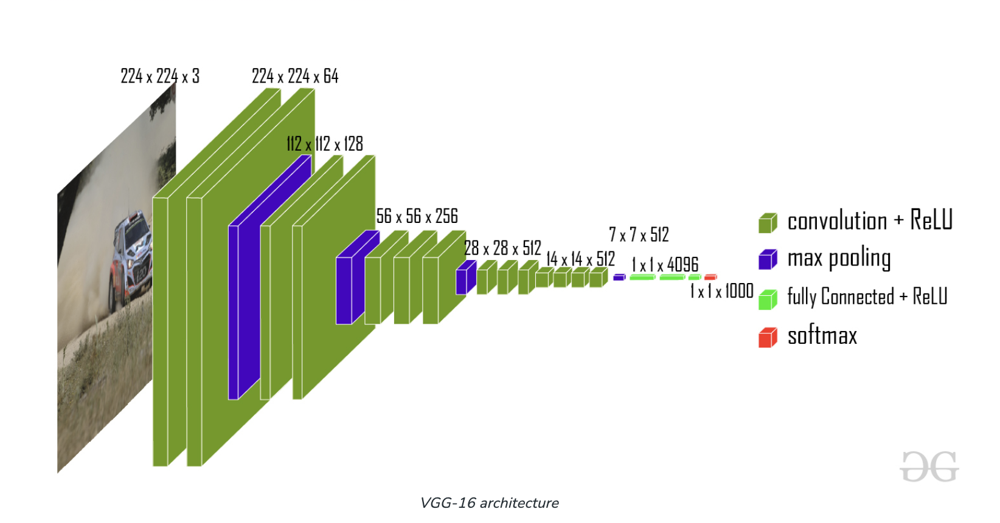
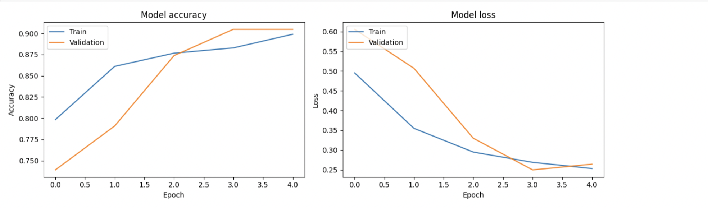
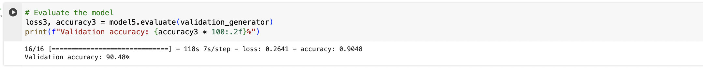
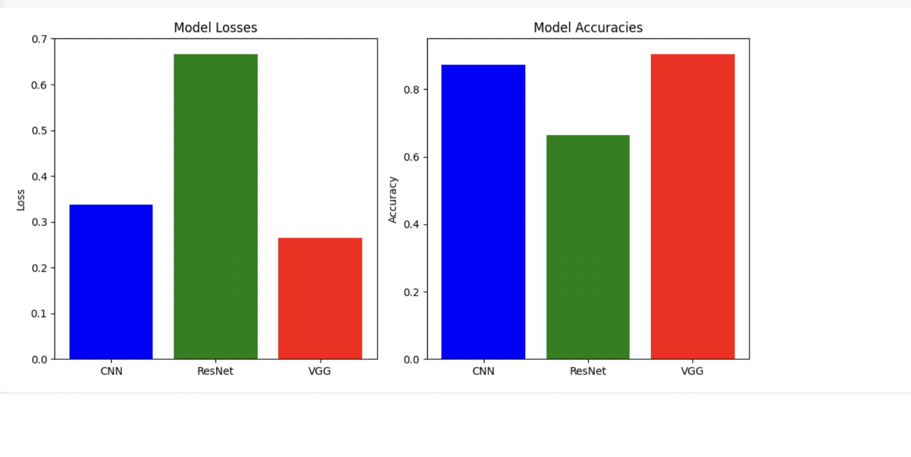
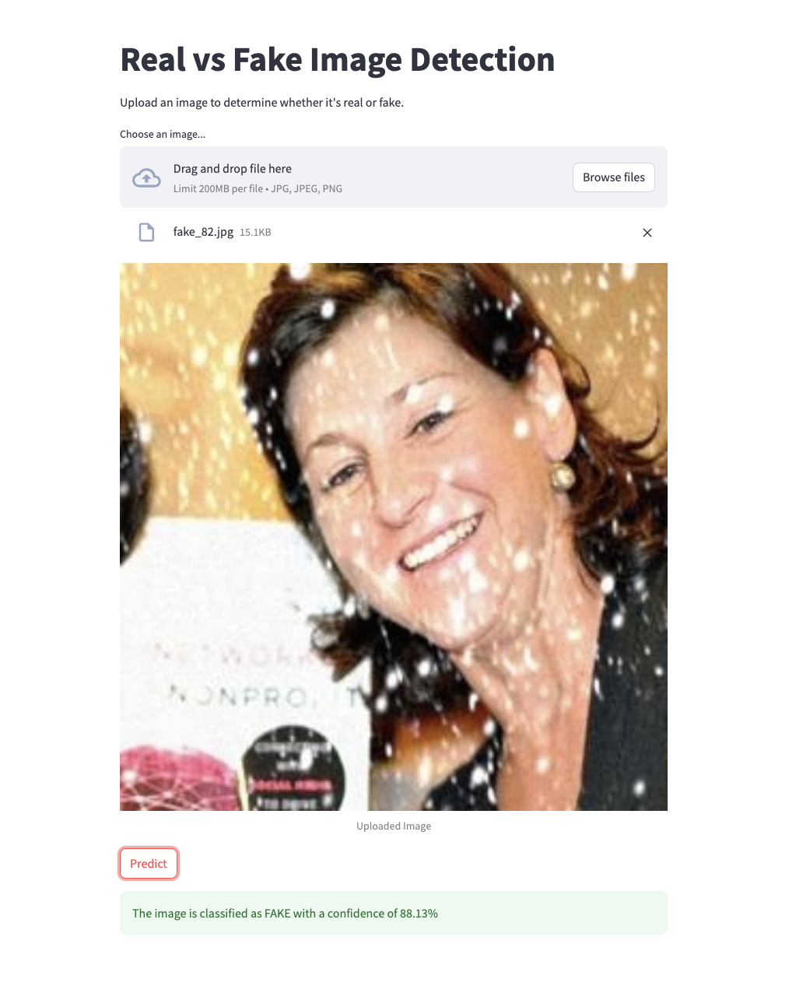
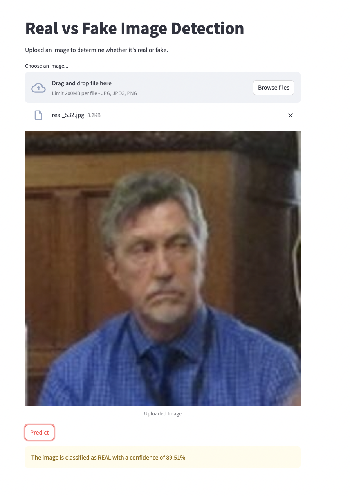

# 1. Deepfake Detection 
- **Project Title:** Deepfake Detection
- **Prepared for:** UMBC Data Science Master Degree Capstone by Dr Chaojie (Jay) Wang
- **Author Name:** Anuhya Reddy Surakanti
- [GitHub](https://github.com/anuhyasurakanti)
- [LinkedIn](https://www.linkedin.com/in/anuhya-reddy-surakanti/)

# 2. Background
### What is it about?
The challenge of identifying fake photos or videos created with deep learning techniques is called DeepFake Detection. Deepfakes are produced by manipulating or replacing certain elements of an original video or image, like a person's face, using machine learning algorithms. Finding these kind of alterations and differentiating them from authentic videos or images is the aim of deepfake detection.

### Why does it matter?
Recent social media scandals involving the replacement of famous people's faces in pornographic films cause grave injury to a person's reputation and permanently damage the identities of both famous and common people, necessitating the development of techniques to identify Deepfake.
Furthermore, it poses a serious risk to the security of biometric data and encourages other fraudulent and counterfeiting actions. DeepFake can be easily implemented by several face-swapping apps like Face2Face and mobile apps like Snapchat that use pre-trained generative adversarial networks.

# 3. Dataset
[Link to dataset](https://www.kaggle.com/datasets/manjilkarki/deepfake-and-real-images/data)
The data is obtained from the source Kaggle. 
- **Data Size:** 46.7MB
- **Data Shape:** The images are divided into train, test and validation sets.
- This dataset is designed with face-wise rich annotations explicitly for face forgery detection and segmentation. 
- All images in the dataset are preprocessed and resized to a resolution of 256 x 256 image of a human face which is either real or fake.
- There are 610 training images with 900 validation images and 2410 test samples.
- There are two classes, Fake and Real.

# 4. Data Preprocessing
- Dataset is downloaded in the form of images and its respective labels.
- Ex:  real_290.jpg
- Each label represents whether the image is real or fake.
- All images in the dataset are preprocessed and resized to a resolution of 256 x 256 image of a human face which is either real or fake.

# 5. Machine Learning Models
The main aim of the project is to apply the following models on the above dataset and evaluate the accuracy of each model on validation and test datasets and observe which model is best fit for the dataset. 
### a. CNN(4 Convolution and Max Pooling Layers):
- A Convolutional Neural Network (CNN) is a deep learning method that is especially useful for picture detection and processing. 
- It consists of several layers, including convolutional, pooling, and fully linked layers. 
- CNN design is inspired by visual processing in the human brain, making it ideal for collecting hierarchical patterns and spatial connections inside images.
- CNNs are widely used in areas such as image classification, object detection, facial recognition, and medical image analysis.

  
  

  

### b. ResNet:
- ResNets (Residual Networks) are a type of deep learning technique that is particularly useful for picture recognition and processing applications. 
- ResNets are notable for their ability to train extremely deep networks without overfitting. ResNets are commonly utilized in keypoint detection activities.
- Keypoint detection is the process of identifying certain points on an object in a picture.

  

  

### c. VGG:
- VGG is a convolutional neural network (CNN) that is noted for its simplicity and efficiency.
- VGGs typically consist of a series of convolutional and pooling layers, followed by a few fully linked layers.
- Architecure of VGG is as follows:
  
  

- The model accuracy and the model loss obtained are as follows:
  
  
  
  

# Evaluation and Result
- The three models are evaluated on the test and validation datasets and the accuracy obtained from both are compared among the three models.
- From the above accuracies obtained from each model we can observe that the VGG has the highest accuracy hence it is the best fit for our dataset.
- 

# 6. Application of the Trained Models
- **Streamlit Application :** For machine learning and data science projects, Streamlit is an open-source Python toolkit that makes it easier to create and distribute eye-catching, unique web applications. Because of its intuitive and user-friendly design, developers may create interactive applications with little to no code.

- Streamlit has many benefits, including simple deployment, real-time engagement, connectivity with data science libraries, and ease of use. It also offers choices for altering the arrangement to meet various project specifications.

- This is the webpage we developed using streamlit application. We can directly upload an image and run the detection button then it runs the detection in the background colab and gives us the output along with accuracy.

# 7. Conclusion
- From the above three models we can observe that the VGG-16 model's performance on the unseen test data is yielding best results with highest accuracy.
- Hence, this model will help us in assessing how well the model generates to new and unseen samples.

# 8. References
1. https://www.gao.gov/products/gao-24-107292

2. https://ieeexplore.ieee.org/document/9105991

3. https://www.pnas.org/doi/10.1073/pnas.2110013119
